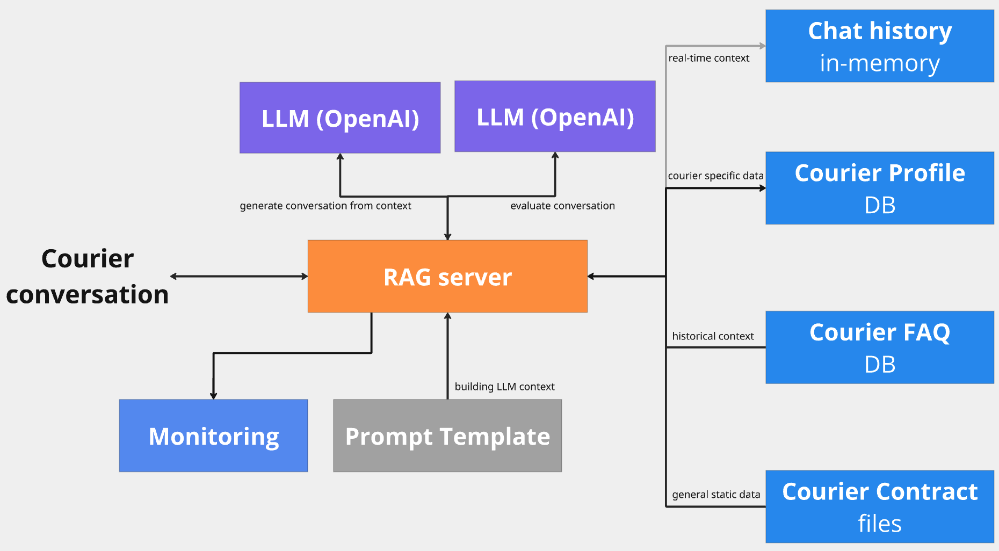

# llm-project
LLM capstone project for the LLM training

### Project description

The iDelivery Courier Support Platform is a server-side application that hosts a sophisticated Conversational AI Agent for real-time engagement with food delivery personnel. This system utilizes a Retrieval-Augmented Generation (RAG) architecture, leveraging an OpenAI-powered (LLM) for natural dialogue synthesis, grounded by domain-specific knowledge of courier profile data stored in NoSql and comprehensive FAQ content stored in Vector Database. The aplication does realtime conversation evaluation and offers a dashboard for monitoring.

### Architecture design



### Technolofgies

- Qdrant vector DB to store FAQ data
- TinyDB NoSql DB to store Courier profile data
- OpenAi as LLM for RAG AI integration
- OpenAi as LLM evaluator
- Flask as API app server
- Grafana + PostgresDb for realtime monitoring

### Running the Jupyter notebooks locally

 - use Python v3.10.x
 - `pip install pipenv`
 - `pipenv shell`
 - `pipenv install` to install all dependencies
 - Start Qdrant: `docker run --rm -p 6333:6333 -p 6334:6334 -v "$(pwd)/tmp_datastore/tmp_qdrant_storage:/qdrant/storage:z" qdrant/qdrant`
 - To access Qdrant UI open in browser: `http://localhost:6333/dashboard#/collections`
 - `python -m ipykernel install --user --name=my_openai_env --display-name="OpenAI Project"`
 - run `jupyter notebook`
 - in Jupyter notebook select Python kernel "OpenAI Project"
 - copy `notebooks/keys_secret.py.tmp` to `notebooks/keys_secret.py` and add your OpenAI API key to `keys_secret.py`
 - run notebooks in order: 
        - `main.ipynb`
        - `evaluation-generating_ground_truth.ipynb`
        - `evaluation-retrieval.ipynb`
        - `evaluation-RAG.ipynb.ipynb`
        

### Evaluation Vector DB retrieval

- present in `evaluation-retrieval.ipynb`
- initial evaluation results using default query parameters: `{'hit_rate': 0.84, 'mrr': 0.71}`
- after evaluating multiple query parameter combinations, results have improuved to:
`{'hit_rate': 0.94, 'mrr': 0.862}` using params: `'score_threshold': 0.7,'limit': 5}`


### Evaluation RAG

Evaluation was done by sending the question, LLM answer and correct answer to LLM using OpenAI 3.5 Turbo.

I evaluated generating the LLM answers separately with `gpt-3.5-turbo`, `gpt-4o-mini` and `gpt-4o`.
LLM answer was generated based on the provided prompt template with FAQ answers as context and the courier profile.

- evaluation code is present in `evaluation-RAD.ipynb`
- evaluation results based on 100 records: 
    - with `gpt-3.5-turbo`:
        ```
        PARTLY_RELEVANT    52
        RELEVANT           37
        NON_RELEVANT       11
        ```
- with `gpt-4o-mini`:
        ```
        RELEVANT           55
        PARTLY_RELEVANT    35
        NON_RELEVANT       10
        ```
- with `gpt-4o`:
        ```
        RELEVANT           51
        PARTLY_RELEVANT    40
        NON_RELEVANT        9

        ```

### Running the Python APP locally

Run commands from root folder:
- use Python v3.10.x
- `pip install pipenv==2025.0.4`
- `pipenv shell`
- `pipenv install` to install all dependencies
- optionally run `pipenv requirements > requirements.txt` to regenerate the requirements.txt which is used in the dockerised version of this app
- Start Qdrant: `docker run --rm -p 6333:6333 -p 6334:6334 -v "$(pwd)/tmp_datastore/tmp_qdrant_storage:/qdrant/storage:z" qdrant/qdrant`
- Qdrant UI: `http://localhost:6333/dashboard#/collections`
- copy and rename `keys_secret.py.tmp` to `app/keys_secret.py`
- fill in `app/keys_secret.py` with the correct secrets
- run `export TOKENIZERS_PARALLELISM=false` to disable now noisy warning
-  `python app/ingest.py` to ingest FAQ and Courier profile data to DBs using
- start API server running one of:
    - `gunicorn --bind 0.0.0.0:9696 --chdir=app server:app`
- run curl commands to interact with entire system:
```sh
$ curl --request POST 'http://127.0.0.1:5000/question' \
--header 'Content-Type: application/json' \
-d '{"question": "Can I keep the provided bike?", "courier_id": 0}'

{
  "answer": "No, you cannot keep the provided bike. The company provides the bike for your use while working, but it must be returned when you are no longer employed or no longer require it for deliveries.",
  "conversation_id": "f22806b91d8845ce86c19897a9eea344"
}
```

```sh
$ curl --request POST 'http://127.0.0.1:5000/feedback' \
--header 'Content-Type: application/json' \
-d '{"conversation_id": "11111111", "positive": true, "feedback": "Good"}'

{
  "message": "Feedback received"
}
```
### Run dockerised verion

- `docker-compose up --build`
- run the `curl` commands from above

### Monitoring

Application is saving conversations data in PostgresDB. Grafana is used to monitor the application in realtime.
Monitoring trtacks:
- courier feedback
- LLM evaluation relevance
- OpenAI tokens
- OpenAI costs
- API tesponse time (including LLM answer generation and LLM evaluation)


##### Manually setup Grafana for the running application:
- open Grafana UI: http://localhost:3000
- setup new datasource for Postgres with host `postgres` and credentials `user` and `user` and disable TLS.
- take the ID of the new datascoruce (see ID in URL) and replace all the `ef04twmg20feoa` in `grafana/dashboard.json` to the new ID.
- create new dashboard in grafana UI by importing the updated `grafana/dashboard.json`

##### Automcatically setup Grafana for running the application:
- ensure `docker-compose up -build` is already running. This creates a Grafana - Postgres  datasource and a monitoring dashboard with pannels.
- run `python grafana/init_grafana.py` from root folder.
- open in browser `http://localhost:3000/d/automatedsetupdashboard/courier-support-agent`
- to see monitoring data, you need to send some questions through curl requests to the application

### TODO:

- [x] generate random Delviery courier profiles unsig AI
- [x] persist courier profiles to a NoSQL DB (TinyDb)
- [x] generate random FAQ courier questions unsig AI
- [x] persist FAQ and answers to a Vector DB (Qdrant)
- [x] generate Courier working contracts (employee and freelance) using AI for a file
- [x] generate complete prompt with non private courier profile information, courier question and best matching FAQ data
- [x] use LLM to get an answer
- [x] generate ground truth data for evaluation
- [x] implement evaluation retrieval
- [x] hyperparameter tuning for evaluation retrieval
- [x] implement evaluation RAG
- [x] evaluation of different LLMs for RAG
- [x] put all code behind an API
- [x] add LLM realtime evaluation
- [x] add Grafana realtime monitoring
- [x] dockerise application
- [ ] add better logging

Optional:
- [ ] use LLM to ask for Contract data when needed
- [ ] use LLM to ask for more profile information when needed by queying the NoSql DB
- [ ] use LLM to ask for more FAQ data when needed by queying the Vector DB
- [ ] use LLM to update Courier profile 
- [ ] use LLM to add new questions and answers to the FAQ DB
- [ ] add chat history on demand to improuve prompt accuracy
